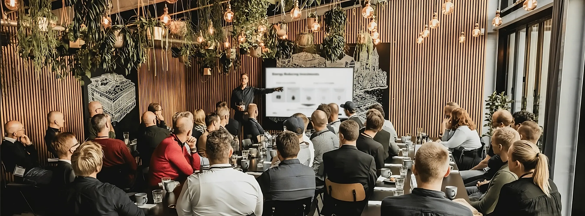

# Roundtable

At Roundtable, we take care of every aspect of car ownership, so you can effortlessly enjoy your cars anytime, anywhere. This project is an exclusive platform targeting elite executives and visionary founders to share their knowledge in exclusive retreats.



## Features

- **Unlimited Potential**: Bringing together 20 minds over 2 days.
- **Exclusive Access**: By invitation only events for the brightest minds of today.
- **Retreats**: Reserved exclusively for elite executives and visionary founders.

## Installation

To use this project locally:

1. Clone the repository:
   ```bash
   git clone https://github.com/Rabbit1026HG/animation-html.git
   ```

2. Navigate to the project directory:
   ```bash
   cd roundtable
   ```

3. Make sure to have a local server setup to host `.html` files (e.g., use [Live Server](https://marketplace.visualstudio.com/items?itemName=ritwickdey.LiveServer) in Visual Studio Code).

## Usage

Open `index.html` in your browser to view and interact with the application.

## Contributing

Contributions are welcome! Please submit a pull request or open an issue to discuss changes you'd like to make.


## Contact

For inquiries, reach out via email: [enquiries@roundtableretreats.com](mailto:enquiries@roundtableretreats.com)


